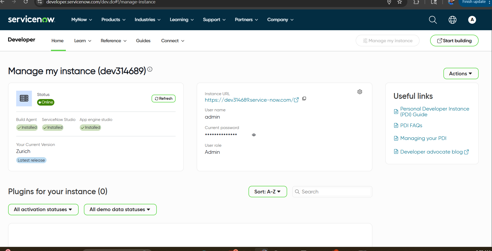
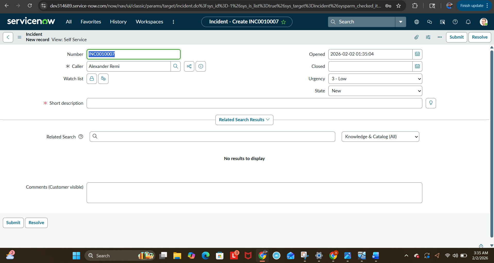
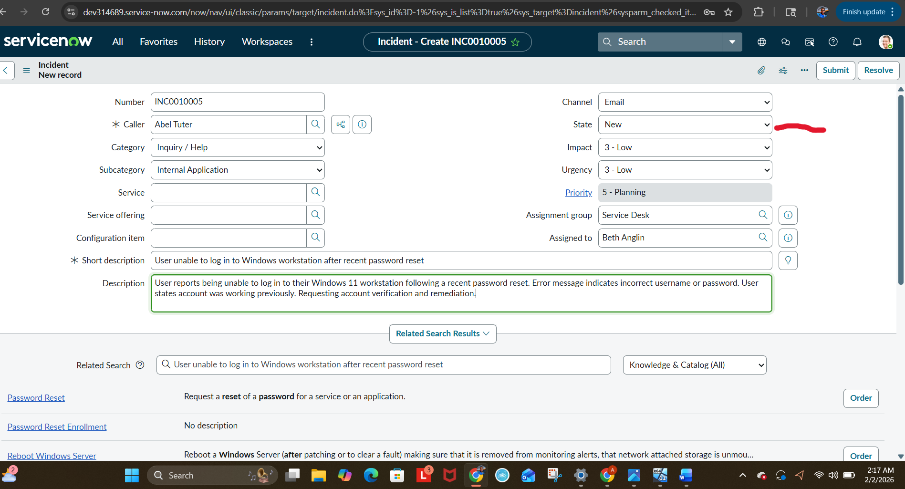
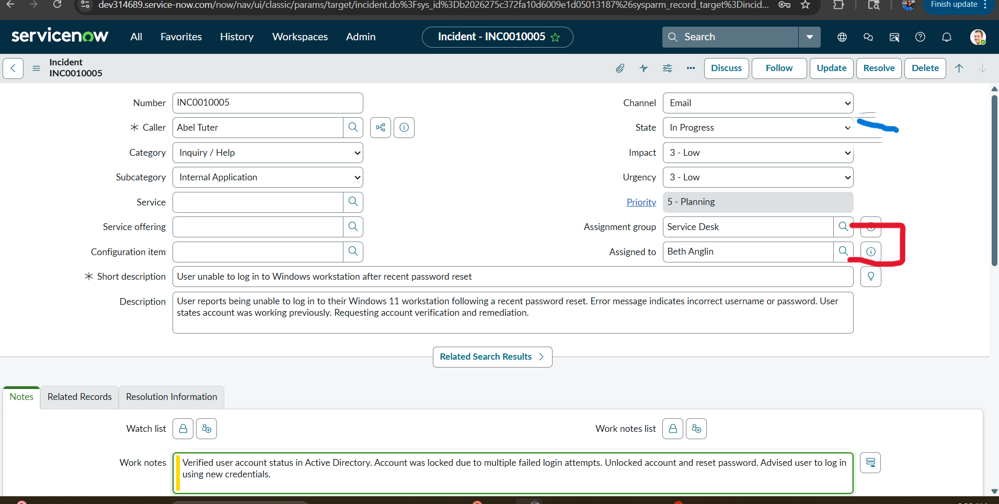
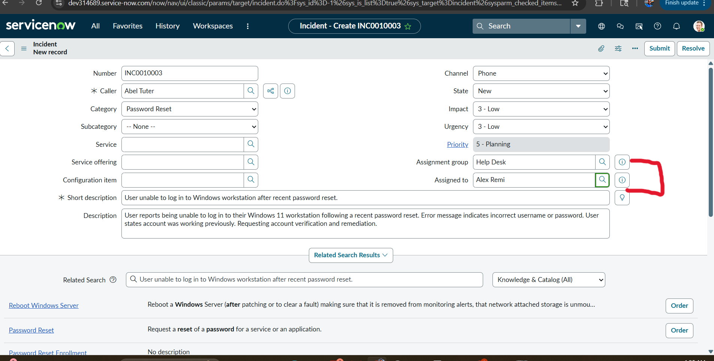
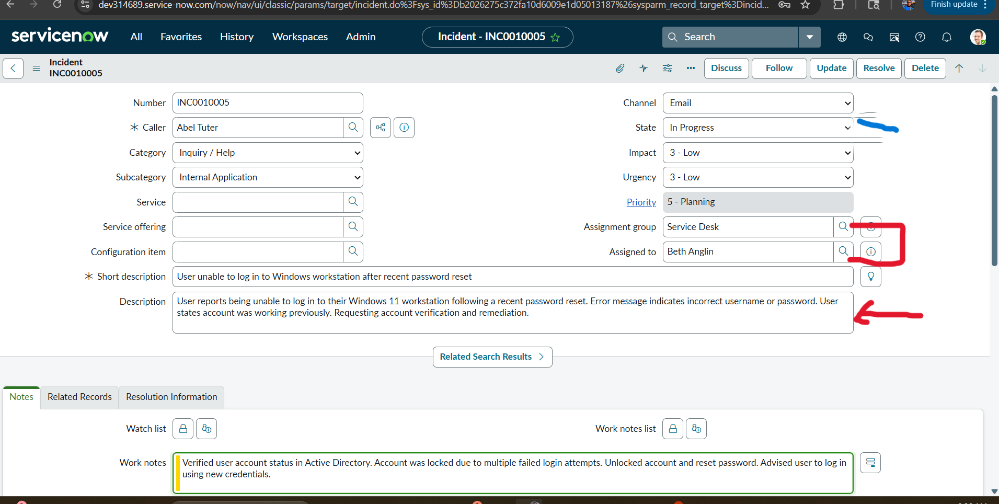
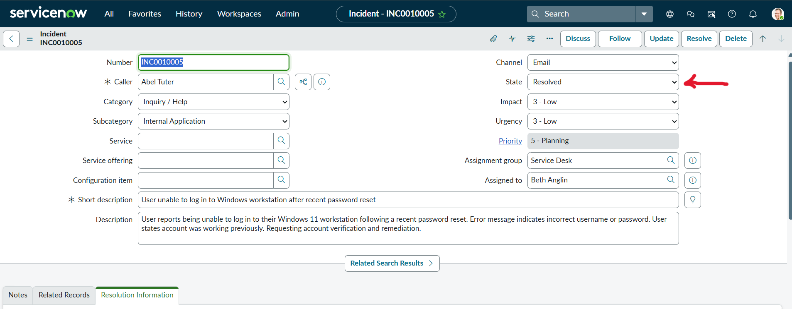

ServiceNow Incident Management Lab
Overview

This lab demonstrates hands-on experience using ServiceNow to create, manage, and resolve an incident from start to finish. I completed this work in a ServiceNow Personal Developer Instance to simulate work place operations, including handling UI limitations, assignments, documentation, and ticket closure.

Environment

Platform: ServiceNow Personal Developer Instance (PDI)

Version: Zurich

Role: Admin

Module: Service Desk → Incidents

Scenario: Windows 11 login issue after password reset

Step 1: Instance Setup

I created a ServiceNow Developer account, requested a Personal Developer Instance, and confirmed the instance was online with admin access.

Screenshot:
📸 ServiceNow instance verified as online:

Step 2: Navigating to the Correct View

After logging in, I initially landed in a Self-Service view, which limited access to key Incident fields.

Obstacle: Missing fields like Assignment Group and Assigned To
Solution: Navigated to Service Desk → Incidents to access the full analyst view.

Screenshots:

Step 3: Creating an Incident

From the Incidents module, I created a new ticket and completed the required fields:

Caller, Category, Subcategory

Short description and detailed issue description

Impact, Urgency, and initial State (New)

Screenshot:
**Screenshot: Creating a new incident**
 

Step 4: Assignment

I assigned the ticket to the Service Desk group and an available analyst.

Obstacle: I could not assign the ticket to myself
Explanation: Assignment is controlled by roles and group membership.

Screenshot:  

Step 5: Working the Incident

I moved the ticket to In Progress and documented troubleshooting steps in Work Notes:

Verified account status in Active Directory

Identified account lockout from failed login attempts

Unlocked account and reset password

Advised user to log in with new credentials

Screenshot: 
 

Step 6: Resolution and Closure

After the user confirmed successful login, I resolved the ticket by completing the Resolution Information section.

Screenshot:

Skills Demonstrated

ServiceNow navigation and incident lifecycle management

Proper ticket documentation and audit trail creation

Assignment logic and role-based access awareness

Windows login troubleshooting with Active Directory context
